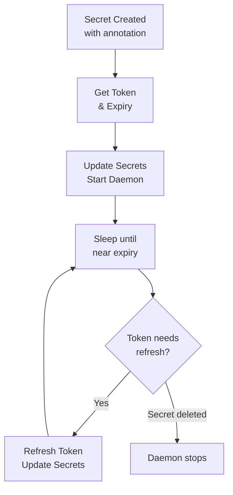

# Secret Operator for Kubernetes

[](https://opensource.org/licenses/Apache-2.0)
[](https://www.python.org/downloads/)
[](https://kubernetes.io/)
[](https://helm.sh/)
[](https://kopf.readthedocs.io/)
[](https://github.com/psf/black)
[](https://github.com/pre-commit/pre-commit)

A Kubernetes operator built with [Kopf](https://kopf.readthedocs.io/) that automatically manages GitHub App authentication secrets with automatic token refresh.

## ✨ Features

- 🔐 **Automatic Secret Management**: Creates and manages basic-auth secrets from annotated secrets
- 🔄 **Smart Token Refresh**: Per-secret daemons that refresh tokens just before expiry (configurable)
- 🎯 **Namespace Scoping**: Watch specific namespaces or cluster-wide (no cluster-admin required!)
- 🧹 **Automatic Cleanup**: Deletes derived secrets when source secrets are removed
- 📊 **Efficient**: Daemon-based architecture prevents unnecessary API calls
- 🛡️ **Secure**: Runs with minimal RBAC permissions, supports non-root containers

## 📋 Table of Contents

- [How It Works](#how-it-works)
- [Installation](#installation)
  - [Using Helm (Recommended)](#using-helm-recommended)
  - [Manual Deployment](#manual-deployment)
  - [Local Development](#local-development)
- [Configuration](#configuration)
- [Usage](#usage)
- [Development](#development)
- [Architecture](#architecture)
- [Contributing](#contributing)

## 🚀 How It Works

1. **Annotate a Secret**: Add `github.axa.com/app-auth: "true"` annotation to any Kubernetes secret
2. **Operator Creates Token**: Calls `get_access_token()` to retrieve a token and expiry time
3. **Updates Original Secret**: Adds `GITHUB_TOKEN` data field and `github.axa.com/token-expiry` annotation
4. **Creates Basic-Auth Secret**: Creates `{secret-name}-basic-auth` with username `x-access-token` and password as the token
5. **Automatic Refresh**: A dedicated daemon monitors the token expiry and refreshes it 5 minutes before expiration
6. **Cleanup on Delete**: When you delete the original secret, the basic-auth secret is automatically removed

## 📦 Installation

### Using Helm (Recommended)

```bash
# Install in a single namespace
helm install secret-operator . \
  --namespace default \
  --set operator.watchNamespaces=default

# Install with multiple namespaces
helm install secret-operator . \
  --namespace default \
  --set operator.watchNamespaces="default,production,staging" \
  --set rbac.additionalNamespaces="{production,staging}"

# Customize values
helm install secret-operator . \
  --namespace default \
  --values my-values.yaml
```

### Values

| Key | Type | Default | Description |
|-----|------|---------|-------------|
| affinity | object | `{}` |  |
| fullnameOverride | string | `""` | Override the full name of the resources |
| image.pullPolicy | string | `"IfNotPresent"` | Image pull policy (Always, IfNotPresent, Never) |
| image.repository | string | `"secret-operator"` | Container image repository |
| image.tag | string | `"latest"` | Overrides the image tag (defaults to the chart appVersion) |
| imagePullSecrets | list | `[]` | List of image pull secrets for private registries |
| nameOverride | string | `""` | Override the name of the chart |
| nodeSelector | object | `{}` |  |
| operator.defaultTokenMinutes | int | `3` | Default token validity in minutes (used in get_access_token function) This is a placeholder - in production, this would come from your auth provider |
| operator.minSleepSeconds | int | `10` | Minimum sleep time between checks in seconds Prevents tight loops in the daemon |
| operator.refreshBufferSeconds | int | `300` | Token refresh buffer in seconds (refresh this many seconds before expiry) Default: 300 seconds (5 minutes) |
| operator.verbose | bool | `false` |  |
| operator.watchNamespaces | string | `"default"` | Namespaces to watch for secrets with the annotation Can be a comma-separated list: "default,production,staging" Use "*" for cluster-wide mode (requires ClusterRole permissions) Leave empty to watch only the operator's namespace |
| podAnnotations | object | `{}` |  |
| podSecurityContext.fsGroup | int | `1000` |  |
| podSecurityContext.runAsNonRoot | bool | `true` |  |
| podSecurityContext.runAsUser | int | `1000` |  |
| rbac.additionalNamespaces | list | `[]` | Additional namespaces where Role and RoleBinding should be created The operator's namespace is automatically included Example: ["production", "staging"] |
| rbac.create | bool | `true` | Create Role and RoleBinding resources |
| replicaCount | int | `1` | Number of replicas for the operator deployment |
| resources.limits.cpu | string | `"200m"` |  |
| resources.limits.memory | string | `"256Mi"` |  |
| resources.requests.cpu | string | `"100m"` |  |
| resources.requests.memory | string | `"128Mi"` |  |
| securityContext.allowPrivilegeEscalation | bool | `false` |  |
| securityContext.capabilities.drop[0] | string | `"ALL"` |  |
| securityContext.readOnlyRootFilesystem | bool | `true` |  |
| serviceAccount.annotations | object | `{}` | Annotations to add to the service account |
| serviceAccount.create | bool | `true` | Specifies whether a service account should be created |
| serviceAccount.name | string | `""` | The name of the service account to use. If not set and create is true, a name is generated using the fullname template |
| tolerations | list | `[]` |  |

----------------------------------------------
Autogenerated from chart metadata using [helm-docs v1.14.2](https://github.com/norwoodj/helm-docs/releases/v1.14.2)

### Manual Deployment

#### 1. Build the Docker Image

```bash
docker build -t secret-operator:latest .

# For local clusters (minikube/kind)
minikube image load secret-operator:latest
# or
kind load docker-image secret-operator:latest
```

#### 2. Deploy with Namespace-Scoped Permissions

```bash
# Create namespaces if needed
kubectl create namespace production
kubectl create namespace staging

# Deploy the operator
kubectl apply -f deployment-namespaced.yaml
```

#### 3. Verify Deployment

```bash
kubectl get pods -l app=secret-operator
kubectl logs -f deployment/secret-operator
```

### Local Development

#### Prerequisites

- Python 3.8+
- Access to a Kubernetes cluster (minikube, kind, or similar)
- kubectl configured to access your cluster

#### Setup

1. Create and activate virtual environment:

```bash
python3 -m venv venv
source venv/bin/activate
```

2. Install dependencies:

```bash
pip install kopf kubernetes
```

3. Run locally (uses your kubeconfig):

```bash
# Watch only default namespace
WATCH_NAMESPACES=default kopf run src/secret_operator.py --verbose

# Watch multiple namespaces
WATCH_NAMESPACES=default,production,staging kopf run src/secret_operator.py --verbose

# Watch all namespaces (cluster-wide)
kopf run src/secret_operator.py --verbose
```

## ⚙️ Configuration

### Helm Values

For complete Helm chart configuration options, see the [Chart README](./Chart.README.md) which is automatically generated from [values.yaml](values.yaml) using [helm-docs](https://github.com/norwoodj/helm-docs).

Key settings:

- `operator.watchNamespaces` - Comma-separated list of namespaces to watch
- `operator.refreshBufferSeconds` - Refresh tokens this many seconds before expiry
- `rbac.additionalNamespaces` - Namespaces where Role/RoleBinding are created
- `resources.limits/requests` - Resource limits and requests

### Environment Variables

| Variable                 | Description                                                | Default |
| ------------------------ | ---------------------------------------------------------- | ------- |
| `WATCH_NAMESPACES`       | Comma-separated namespaces to watch (`*` for cluster-wide) | `*`     |
| `REFRESH_BUFFER_SECONDS` | Refresh tokens this many seconds before expiry             | `300`   |
| `minSleepSeconds`        | Minimum sleep time between checks (avoid tight loops)      | `10`    |

## 📖 Usage

### Create a Secret with the Annotation

```yaml
apiVersion: v1
kind: Secret
metadata:
  name: my-app-secret
  namespace: default
  annotations:
    github.axa.com/app-auth: "true"
type: Opaque
data:
  api-key: bXktYXBpLWtleQ==
```

Apply it:

```bash
kubectl apply -f test-secret.yaml
```

### Check the Results

```bash
# Original secret now has GITHUB_TOKEN and expiry annotation
kubectl get secret my-app-secret -o yaml

# New basic-auth secret was created
kubectl get secret my-app-secret-basic-auth -o yaml

# Check the operator logs
kubectl logs -f deployment/secret-operator
```

### Delete the Secret

```bash
# The basic-auth secret is automatically deleted too
kubectl delete secret my-app-secret
```

## 🛠️ Development

### Setup Development Environment

```bash
# Create and activate virtual environment
python3 -m venv venv
source venv/bin/activate

# Install dependencies
pip install kopf kubernetes

# Install development dependencies
pip install pytest pytest-cov pytest-asyncio unittest-mock

# Install pre-commit
pip install pre-commit
pre-commit install
```

### Project Structure

```
python-kubernetes-operator/
├── src/
│   └── secret_operator.py    # Main operator code
├── tests/
│   ├── conftest.py           # Test fixtures (mock_logger)
│   └── test_operator.py      # All unit tests
├── Chart.yaml                # Helm chart metadata
├── values.yaml               # Helm chart values
├── templates/                # Helm templates
├── Dockerfile                # Container image
├── pytest.ini                # Pytest configuration
└── .pre-commit-config.yaml   # Pre-commit hooks
```

### Running Tests

```bash
# Run all tests
pytest

# Run with coverage report
pytest --cov=src --cov-report=html

# Run specific test file
pytest tests/test_operator.py

# Run specific test
pytest tests/test_operator.py::TestGetAccessToken::test_returns_token_and_expiry

# Run with verbose output
pytest -v

# Run and show print statements
pytest -s
```

### Test Classes

The test suite includes:

- **`TestGetAccessToken`**: Tests for token generation function
- **`TestUpdateSecretsWithToken`**: Tests for secret update logic with kopf.adopt mocking
- **`TestHandleSecretCreate`**: Tests for the initial secret creation handler
- **`TestTokenRefreshDaemon`**: Async tests for the token refresh daemon
- **`TestUpdateSecretsWithTokenExceptions`**: Exception handling tests
- **`TestKopfHandlers`**: Tests for kopf handler filter conditions

### Test Coverage

The project includes:

- **Unit tests** for core functions (token generation, secret updates, daemon behavior)
- **Mock Kubernetes API** using `unittest.mock` to test without a real cluster
- **Async tests** for kopf daemon functions using `pytest-asyncio`
- **Test fixtures** in `tests/conftest.py` for common mock objects
- **Coverage reporting** to ensure code quality
- **Automated test runs** via pre-commit hooks

View the HTML coverage report:

```bash
pytest --cov=src --cov-report=html
open htmlcov/index.html
```

### Pre-commit Hooks

This project uses pre-commit hooks for code quality:

```bash
# Install pre-commit
pip install pre-commit

# Install the git hooks
pre-commit install

# Run manually
pre-commit run --all-files
```

Hooks include:

- **black**: Python code formatting
- **isort**: Import sorting
- **flake8**: Linting
- **pytest**: Automated tests with coverage
- **bandit**: Security checks
- **yamllint**: YAML validation
- **helmlint**: Helm chart validation
- **hadolint**: Dockerfile linting
- **markdownlint**: Markdown formatting

### Run Tests

```bash
# Create a test secret
kubectl apply -f test-secret.yaml

# Watch operator logs
kubectl logs -f deployment/secret-operator

# Verify the basic-auth secret
kubectl get secret app-auth-secret-basic-auth -o jsonpath='{.data.password}' | base64 -d
```

### Build and Push Image

```bash
# Build
docker build -t your-registry/secret-operator:v1.0.0 .

# Push
docker push your-registry/secret-operator:v1.0.0

# Update deployment
kubectl set image deployment/secret-operator operator=your-registry/secret-operator:v1.0.0
```

## 🏗️ Architecture

### Components

- **Handler (`@kopf.on.create`)**: Processes newly created secrets with the annotation (filters on annotation and absence of expiry)
- **Daemon (`@kopf.daemon`)**: Per-secret background process that monitors token expiry and refreshes proactively
- **Owner References (`kopf.adopt`)**: Establishes parent-child relationship for automatic cleanup
- **Helper Functions**:
  - `get_access_token(min)`: Retrieves token with expiry timestamp
  - `update_secrets_with_token()`: Updates original secret and creates/updates basic-auth secret

### Kopf Decorators

- **`@kopf.on.create`**: Triggered when secrets are created with:
  - Annotation: `github.axa.com/app-auth: "true"`
  - Filter: Only when `github.axa.com/token-expiry` is absent (prevents re-processing)
- **`@kopf.daemon`**: Runs continuously for each matching secret with:
  - Annotation filter: `github.axa.com/app-auth: "true"`
  - Cancellation timeout: 1 second
  - Initial delay: 30 seconds

### Token Refresh Flow



### RBAC Permissions

The operator requires:

- **Secrets**: `get`, `list`, `watch`, `patch`, `update`, `create`, `delete`
- **Events**: `create` (for logging events)

No cluster-level permissions needed when using namespace-scoped roles!

## 🤝 Contributing

Contributions are welcome! Please:

1. Fork the repository
2. Create a feature branch (`git checkout -b feature/amazing-feature`)
3. Install pre-commit hooks (`pre-commit install`)
4. Make your changes
5. Run tests and linting (`pre-commit run --all-files`)
6. Commit your changes (`git commit -m 'Add amazing feature'`)
7. Push to the branch (`git push origin feature/amazing-feature`)
8. Open a Pull Request

## 📄 License

This project is licensed under the Apache License 2.0 - see the [LICENSE](LICENSE) file for details.

## 🙏 Acknowledgments

- Built with [Kopf](https://kopf.readthedocs.io/) - Kubernetes Operator Pythonic Framework
- Inspired by the need for automatic GitHub App token management in Kubernetes

## 📞 Support

- 📫 Issues: [GitHub Issues](https://github.com/olivergoetz/python-kubernetes-operator/issues)
- 💬 Discussions: [GitHub Discussions](https://github.com/olivergoetz/python-kubernetes-operator/discussions)

---

Made with ❤️ by Oliver Goetz
